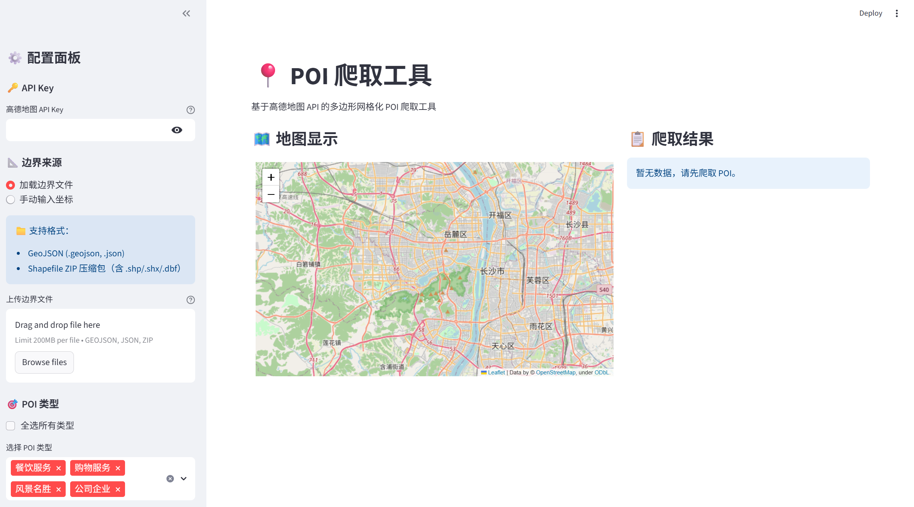

# POI 爬取工具

一个基于高德地图 API 的多边形网格化 POI（兴趣点）爬取工具，支持边界文件加载、坐标自动转换、数据可视化验证和 Web 界面操作。该工具使用TREA SOLO CODE软件，全程AI协助开发。

## 功能特性

- **网格化爬取策略**：自动将大区域切分为小网格逐格爬取，突破 API 单次返回 900 条数据的限制
- **Shapefile/GeoJSON 边界加载**：直接加载 ESRI Shapefile 或 GeoJSON 格式的边界文件
- **坐标系自动转换**：支持 WGS84 ↔ GCJ02 坐标转换，确保在高德地图上准确显示
- **23 大类 POI 覆盖**：汽车服务、餐饮、购物、交通、景点、金融等完整类型体系
- **可视化验证**：爬取完成后自动生成 POI 空间分布图和类型统计图
- **数据导出**：支持 CSV 和 JSON 格式导出
- **Web 界面**：提供友好的 Streamlit 图形界面，支持实时地图显示和交互

## 快速开始

### 方式一：Web 界面（推荐）

```bash
# 1. 安装依赖
pip install -r requirements.txt

# 2. 启动 Web 应用
streamlit run streamlit_app.py

# 3. 浏览器自动打开 http://localhost:8501
```

### 方式二：命令行

```bash
# 使用边界文件爬取所有类型 POI
python run.py --boundary-file inputs/boundary/调研边界.shp --all-types

# 爬取餐饮类 POI
python run.py --boundary-file inputs/boundary/调研边界.shp --types 050000
```

## Web 界面使用

### 界面预览



### 界面布局

```
┌──────────────────────────────────────────────────────────────────┐
│  📍 POI 爬取工具                                                  │
│                                                                  │
│  ┌─────────────────────────────┐  ┌──────────────────────────┐ │
│  │ 🗺️ 地图显示区域              │  │ ⚙️ 配置面板               │ │
│  │                             │  │                           │ │
│  │ [显示爬取边界和POI点]        │  │ 🔑 API Key               │ │
│  │                             │  │ 📐 边界来源               │ │
│  │                             │  │ 🎯 POI 类型（23类）       │ │
│  │                             │  │ ⚙️ 爬取设置               │ │
│  └─────────────────────────────┘  │ [🚀 开始] [⏹️ 停止]      │ │
│  ┌─────────────────────────────┐  └──────────────────────────┘ │
│  │ 📊 结果统计                  │                                 │
│  │ [数据表格] [类型分布图]      │                                 │
│  │ [导出 CSV] [导出 JSON]      │                                 │
│  └─────────────────────────────┘                                 │
└──────────────────────────────────────────────────────────────────┘
```

### Web 界面功能

✅ **配置面板**
- API Key 输入
- 边界文件上传（支持 GeoJSON 或 Shapefile ZIP）
- 多边形坐标手动输入
- POI 类型多选（23 大类，支持全选）
- 网格大小选择（100米 ~ 2公里）
- 请求间隔设置

✅ **地图显示**
- OpenStreetMap 底图
- 红色矩形显示爬取边界
- 彩色圆点显示 POI 位置（按类型着色）
- 点击 POI 查看详情

✅ **爬取控制**
- 实时进度条
- 开始/停止按钮
- 实时统计（POI 数量、类型分布）
- 后台运行，不卡界面

✅ **结果展示**
- 交互式数据表格
- 类型分布柱状图
- 一键导出 CSV/JSON

## 项目结构

```
POI-Crawler/
├── config.py                     # 配置文件（API Key、默认参数）
├── run.py                        # 命令行入口
├── streamlit_app.py              # Web 界面入口
├── requirements.txt              # 依赖库
│
├── app/                         # Streamlit Web 应用
│   ├── __init__.py
│   ├── sidebar.py               # 侧边栏配置组件
│   ├── map_viewer.py            # 地图显示组件
│   ├── crawl_worker.py          # 爬取任务处理
│   └── result_viewer.py         # 结果展示组件
│
├── crawlers/                     # 爬取模块
│   ├── __init__.py
│   ├── api_endpoints.py         # API 端点
│   └── grid_polygon_crawler.py  # 网格化多边形爬虫（核心）
│
├── utils/                       # 工具模块
│   ├── __init__.py
│   ├── coordinate_converter.py  # WGS84 ↔ GCJ02 坐标系转换
│   ├── grid_generator.py        # 网格生成器
│   ├── shapefile_loader.py      # Shapefile/GeoJSON 边界加载
│   ├── poi_types.py             # POI 类型定义（23 大类）
│   └── visualizer.py            # 爬取结果可视化
│
├── processors/                  # 数据处理
│   └── data_processor.py        # 数据清洗和提取
│
├── outputs/                     # 输出模块
│   ├── __init__.py
│   ├── data_exporter.py         # CSV/JSON 导出
│   ├── poi_distribution.png     # POI 分布图（自动生成）
│   └── poi_type_distribution.png # 类型分布图（自动生成）
│
├── inputs/                      # 输入数据
│   ├── boundary/                # 边界文件（Shapefile/GeoJSON）
│   └── POI/                     # 参考 POI 数据
│
├── test_crawler.py              # 爬虫测试脚本
├── test_visualizer.py          # 可视化测试脚本
└── readme.md                   # 本文件
```

## 环境要求

- Python 3.7+
- 高德地图 API Key

## 安装依赖

```bash
pip install -r requirements.txt
```

### 完整依赖（Web 界面 + 可视化）
```
requests>=2.28.0
geopandas>=0.12.0
coord_convert>=2.0.0
streamlit>=1.30.0
folium>=0.14.0
matplotlib>=3.6.0
seaborn>=0.12.0
numpy>=1.23.0
pandas>=2.0.0
```

### 最小依赖（仅命令行）
```bash
pip install requests geopandas coord_convert
```

## 配置说明

### Web 界面配置
在侧边栏直接输入你的高德地图 API Key。

### 命令行配置
打开 [config.py](file:///d:\爬虫\POI-Crawler\config.py)，配置你的 API 密钥：

```python
AMAP_API_KEY = "你的API密钥"
```

**获取 API Key**：
1. 访问 [高德开放平台](https://lbs.amap.com/)
2. 注册并登录账号
3. 创建应用并获取 Web 服务 API Key

## 使用方法

### Web 界面（方式一）

```bash
streamlit run streamlit_app.py
```

然后在浏览器中：
1. 输入 API Key
2. 上传边界文件或手动输入坐标
3. 选择 POI 类型
4. 点击「开始爬取」
5. 查看地图和数据结果

### 命令行（方式二）

| 参数 | 必填 | 说明 |
|------|------|------|
| `--boundary-file` | 二选一 | Shapefile 或 GeoJSON 边界文件路径 |
| `--polygon` | 二选一 | 多边形坐标，格式: "lon1,lat1\|lon2,lat2\|..." |
| `--types` | 否 | POI 类型编码，多个类型用逗号分隔（如: 050000,060000） |
| `--all-types` | 否 | 爬取全部 23 大类 POI |
| `--api-key` | 否 | 指定 API Key（覆盖 config.py） |
| `--keyword` | 否 | 关键词过滤（如: "餐厅"） |
| `--grid-size` | 否 | 网格精度，0.001-0.02，默认 0.005 |
| `--request-interval` | 否 | API 请求间隔（秒），默认 0.2 |
| `--format` | 否 | 输出格式，csv 或 json |
| `--no-visualize` | 否 | 禁用可视化图片生成 |
| `--list-types` | - | 列出所有 POI 类型并退出 |

### 命令行示例

```bash
# 1. 查看所有 POI 类型
python run.py --list-types

# 2. 爬取餐饮和购物
python run.py --boundary-file inputs/boundary/调研边界.shp --types 050000,060000

# 3. 爬取所有类型（23 大类）
python run.py --boundary-file inputs/boundary/调研边界.shp --all-types

# 4. 精细网格（适合密集区域）
python run.py --boundary-file inputs/boundary/调研边界.shp --grid-size 0.002

# 5. 关键词过滤
python run.py --boundary-file inputs/boundary/调研边界.shp --types 050000 --keyword "肯德基"
```

## POI 类型编码

| 编码 | 名称 |
|------|------|
| 010000 | 汽车服务 |
| 020000 | 汽车销售 |
| 030000 | 汽车维修 |
| 040000 | 摩托车服务 |
| 050000 | 餐饮服务 |
| 060000 | 购物服务 |
| 070000 | 生活服务 |
| 080000 | 体育休闲服务 |
| 090000 | 医疗保健服务 |
| 100000 | 住宿服务 |
| 110000 | 风景名胜 |
| 120000 | 商务住宅 |
| 130000 | 政府机构及社会团体 |
| 140000 | 科教文化服务 |
| 150000 | 交通设施服务 |
| 160000 | 金融保险服务 |
| 170000 | 公司企业 |
| 180000 | 道路附属设施 |
| 190000 | 地名地址信息 |
| 200000 | 公共设施 |
| 220000 | 事件活动 |
| 970000 | 室内设施 |
| 990000 | 通行设施 |

## 网格大小建议

| 网格大小 | 实际覆盖 | 适用场景 |
|----------|----------|----------|
| 0.001 | ~110m × 100m | 极精细覆盖 |
| 0.002 | ~220m × 200m | 高精度需求 |
| 0.005 | ~550m × 500m | 平衡精度与速度（默认） |
| 0.01 | ~1.1km × 1.1km | 快速大范围扫描 |
| 0.02 | ~2.2km × 2km | 超快速扫描 |

## 坐标系说明

### 为什么需要坐标转换？

- **高德地图 API**：返回的是 **GCJ02（火星坐标系）**
- **OpenStreetMap / GPS**：使用的是 **WGS84 标准坐标系**
- 两者在中国地区有 500-1000 米的偏移

### 本工具的处理方式

- ✅ 爬取时自动转换坐标
- ✅ 导出数据使用 GCJ02，可直接在高德地图上使用
- ✅ Web 界面显示使用 WGS84，与 OpenStreetMap 对齐

## 输出说明

### 数据文件
- CSV/JSON 文件保存在 `outputs/` 目录
- 文件命名: `poi_data_YYYYMMDD_HHMMSS.{csv|json}`

### 可视化图片（命令行模式）
爬取完成后自动生成两张验证图：

1. **poi_distribution.png** - POI 空间分布图
   - 红色矩形：爬取边界
   - 彩色散点：各类型 POI

2. **poi_type_distribution.png** - POI 类型分布柱状图
   - 各类 POI 数量统计

## 运行测试

```bash
# 测试核心功能（不调用真实 API）
python test_crawler.py --api-key YOUR_KEY --skip-real

# 测试可视化功能
python test_visualizer.py
```

## 注意事项

- 高德地图 API 免费版有调用频率（QPS）和日调用量限制，请合理设置请求间隔
- 大区域或精细网格爬取时间较长，建议先用小区域测试
- 爬取边界文件建议使用 GCJ02（国测局）坐标系
- API Key 等敏感信息请勿提交到公开仓库

## 许可证

MIT License
